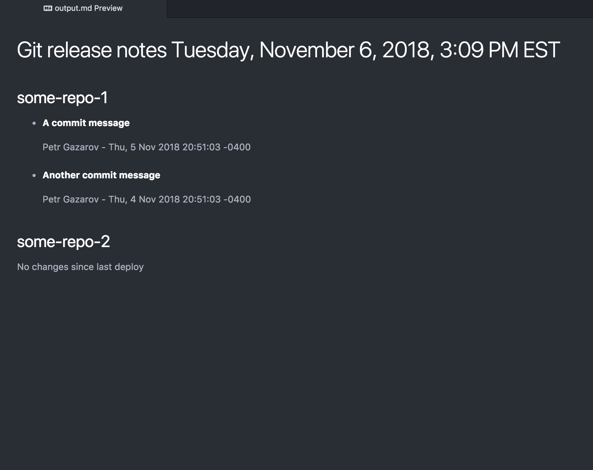

# clause-git-release-notes

The script produces a formatted markdown file with a summary of all new commits.
New commits are calculated based on the output of `git log`, where the range is set as `toBranch..fromBranch`.

`config.json` file contains configuration necessary for the script to run normally. Notice that relative paths are important and
the script expects to find specified git repositories in the paths set in config.json.

When running `git log`, it is assumed that repositories share branches of the same name `toBranch` and `fromBranch`.
The default branch names are specified in `config.json`, but can also be set via command line.
The script fetches latest code from the remote set as `config.remoteName`. If you have uncommited changes in any of the repositories,
you must commit them prior to running this script. Otherwise, the script will fail at `git checkout` command.

Example usage, from root of repository:

```
// uses default branch values
yarn generate-release-notes

// specify branch values
yarn generate-release-notes fromBranch=master toBranch=staging
```

See `output.md` file for the output result of the script.

Sample preview of output.md:


